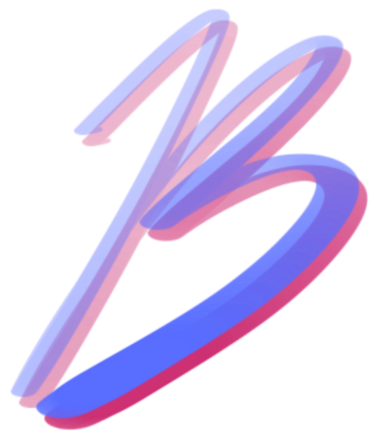

<!-- 
    *************
    ************* 기술 스택
    *************
 -->
 
👋 &nbsp 안녕하세요 4년차 프론트엔드 개발자 방진웅 입니다

 
 
🏢 &nbsp 2019.03 ~ 2022.07 까지 (주)맑은기술에서 웹 개발자로 재직했으며

 
🛠 &nbsp 주로 프론트엔드 개발과 미들웨어 WAS 개발 업무를 담당했습니다.

 
🎓 &nbsp 삼육대학교를 졸업했고,

 
📚 &nbsp 환경그린디자인학 & 경영학을 복수전공 했습니다.

<!-- 
    *************
    ************* 기술 스택
    *************
 -->
 
<h1 align="">
<!--  -->
✔️ 
&nbsp 기술 스택</h1>
<h3 align="">✔️ &nbsp 업무에도 활용해요</h3>

&nbsp&nbsp&nbsp&nbsp&nbsp&nbsp&nbsp&nbsp

&nbsp&nbsp&nbsp

&nbsp&nbsp

&nbsp
&nbsp&nbsp

&nbsp&nbsp

&nbsp
&nbsp
&nbsp
&nbsp
&nbsp
&nbsp
&nbsp

 

<h3 align="">✔️  &nbsp 어느정도 사용할 줄 알아요</h3>

&nbsp

&nbsp&nbsp&nbsp&nbsp&nbsp

<!-- 
    *************
    ************* 진행 프로젝트
    *************
 -->
 
<h1 align="">&nbsp 프로젝트</h1>

&nbsp&nbsp&nbsp&nbsp&nbsp&nbsp&nbsp&nbsp&nbsp&nbsp CMS 웹 서비스 개발

&nbsp&nbsp&nbsp&nbsp&nbsp&nbsp&nbsp&nbsp&nbsp&nbsp SNS 용 영상 편집 웹 서비스 개발

&nbsp&nbsp&nbsp&nbsp&nbsp&nbsp&nbsp&nbsp&nbsp&nbsp 에 납품된 SW 시스템 유지보수

&nbsp&nbsp&nbsp&nbsp&nbsp&nbsp&nbsp&nbsp&nbsp&nbsp&nbsp&nbsp&nbsp CMS 웹 서비스 개발

&nbsp&nbsp&nbsp&nbsp&nbsp&nbsp CMS 웹 서비스 개발

&nbsp&nbsp&nbsp&nbsp&nbsp&nbsp AWS S3 미디어 전송 작업 관리 및 모니터링 Front-end 개발

&nbsp&nbsp&nbsp&nbsp&nbsp&nbsp&nbsp&nbsp&nbsp&nbsp&nbsp&nbsp&nbsp 방송 입고 현황 모니터링 웹 서비스 개발

&nbsp&nbsp&nbsp&nbsp&nbsp&nbsp&nbsp&nbsp&nbsp&nbsp&nbsp&nbsp&nbsp 납품된 솔루션 시스템 관리자 웹 페이지 개발 참여

&nbsp&nbsp&nbsp&nbsp&nbsp&nbsp&nbsp&nbsp&nbsp&nbsp&nbsp&nbsp&nbsp 납품된 솔루션 API 서버 개발 참여

<!-- 
    *************
    ************* 핵심 역량
    *************
 -->
 
<h1 align="">&nbsp 핵심 역량</h1>
<!-- <h1 align="center">&nbsp Core Competency</h1> -->

🎥 HTML5 비디오 플레이어 UI 커스텀 구현 경험

✂️ Canvas 를 활용한 frame 단위의 영상 구간 자르기 및 영역 자르기 UI 구현 경험

✂️ FFmpeg 기반의 사내 솔루션을 활용한 영상 영역 및 구간 자르기 기능 구현 경험

✂️ AWS Mediaconvert 솔루션을 활용한 영상 구간 자르기 기능 구현 경험

📊 Recharts JS / Chart JS기반 통계 페이지 구현 경험

🖥 반응형 및 크로스 브라우징 웹 페이지 구현 경험

🛠 Spring boot 미들웨어 구현 및 배포 경험

🎨 화면정의서, 디자인, 화면 개발까지 제품 구현 경험

🎨 일러스트레이터, 포토샵, 피그마 등 디자인 툴 활용 가능

<!-- 
    *************
    ************* 경력
    *************
 -->
 
<h1 align="">&nbsp 경력</h1>

_
2022년 7월 ~ 2019년 3월
_

<h3 align="">🏢 (주)맑은기술</h3>

Front-end 또는 BFF 미들웨어 개발

CMS 웹 서비스 개발

 

_
2018년 6월 ~ 2018년 12월
_
<h3 align="">📚 비트캠프</h3>

국비지원 웹 개발 교육

Java, Javascript, SQL, HTML, CSS 등 기본적인 웹 개발 언어 및 도구 학습

 

_
2017년 8월 ~ 2018년 5월
_
<h3 align="">🏢 TheSMC</h3>

SNS 광고 대행 업무 담당

PPT 기획안 작성을 통한 디자이너와 커뮤니케이션 경험

 

_
2010년 3월 ~ 2017년 2월
_
<h3 align="">🎓 삼육대학교 졸업</h3>

환경그린디자인학과 & 경영학과

일러스트레이터, 포토샵 디자인 툴에 대한 학습

